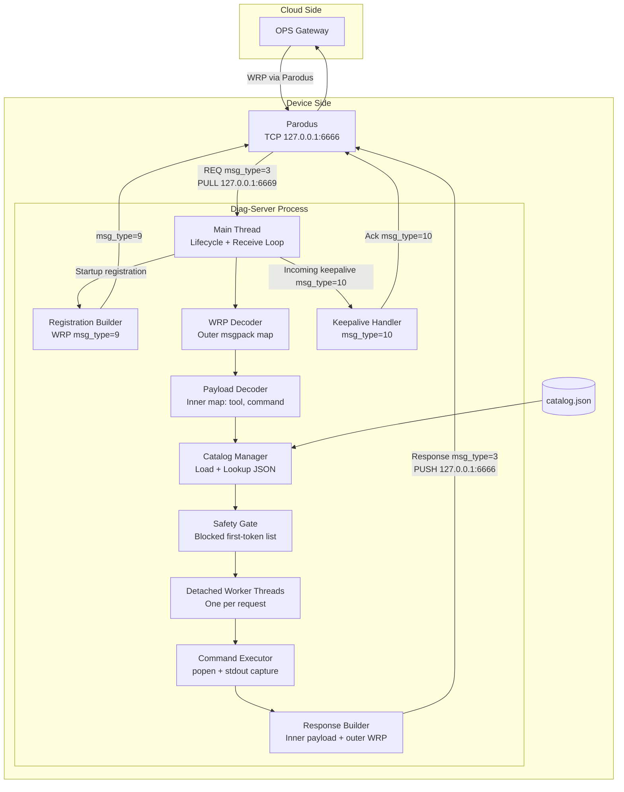
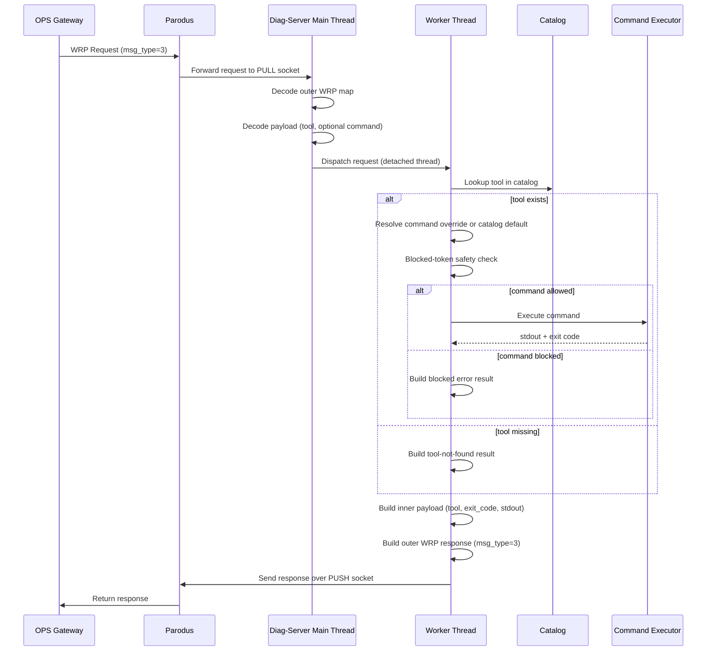
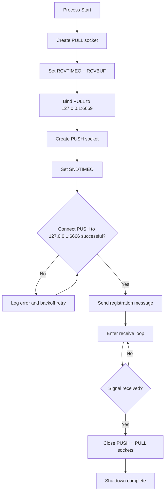
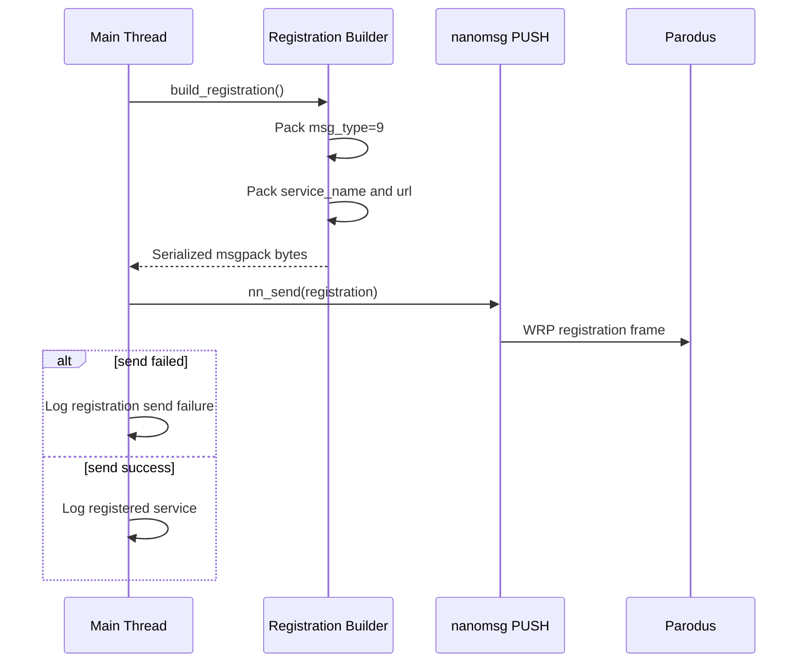
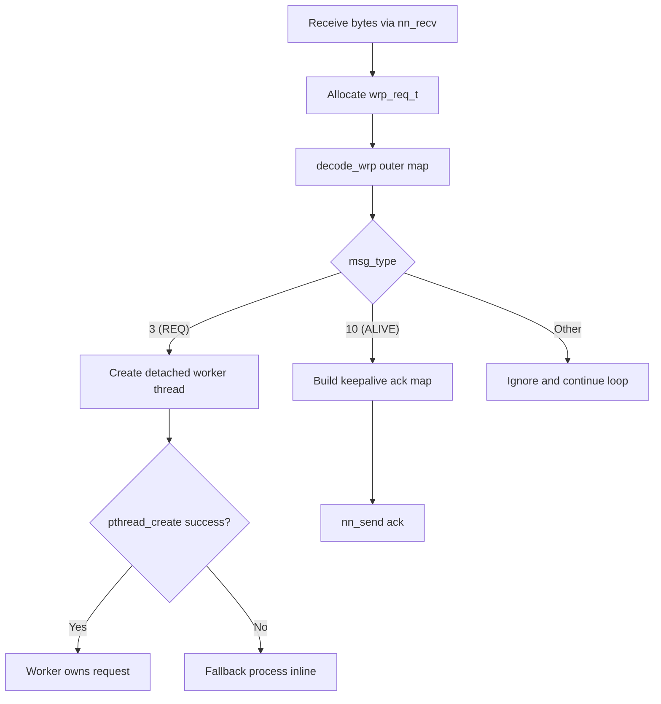
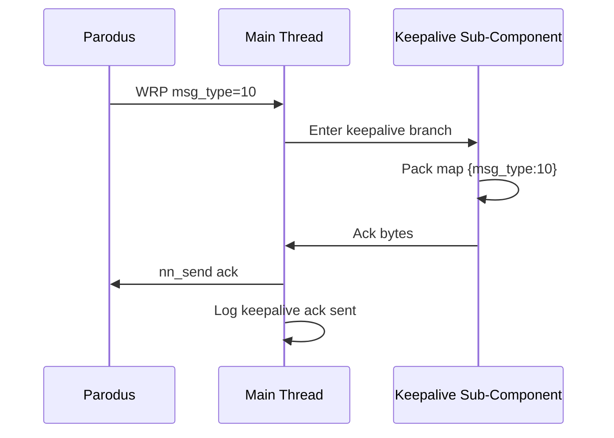
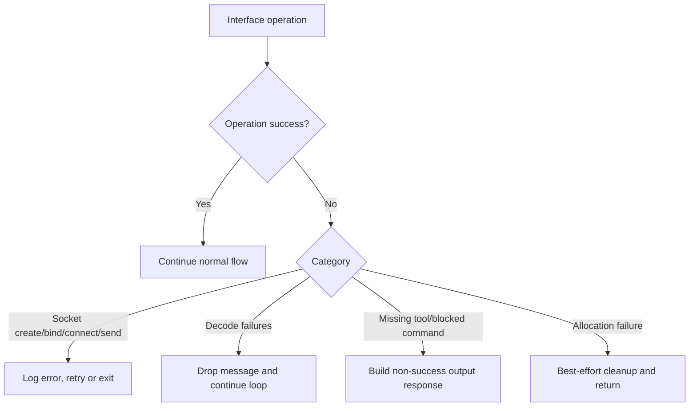

# Diag-Server Architecture Diagram

This architecture is derived from the runtime behavior implemented in the service code.

## 1. Component Architecture



## 2. Request Processing Workflow



## 3. Runtime Boundaries and Responsibilities

1. Main Thread
- Owns startup, socket setup, registration, receive loop, and keepalive acknowledgments.
- Stays responsive by delegating request execution to detached workers.

2. Worker Thread
- Owns per-request decoding context, catalog validation, command safety validation, execution, and response send.

3. Catalog
- Defines allowed tool names and default commands.
- Acts as first allowlist boundary for remote requests.

4. Safety Gate
- Denies execution when the first command token is in blocked set.

5. Executor
- Captures command stdout with a fixed upper bound.
- Returns process exit code for response payload.

## 4. Key Interfaces

- Inbound from Parodus: WRP msgpack over nanomsg PULL, bound at 127.0.0.1:6669.
- Outbound to Parodus: WRP msgpack over nanomsg PUSH, connected to 127.0.0.1:6666.
- Catalog file: JSON from default /etc/diag-server/catalog.json or startup override argument.

## 5. Notes from Current Code Baseline

- Catalog timeout field exists in JSON but is not enforced by current execution path.
- Command execution currently uses shell-based popen behavior.
- Request handlers run concurrently in detached pthreads.

## 6. Interface Sub-Component Workflows

### 6.1 Transport Interface Workflow (Socket Lifecycle)



Primary code path mapping:
- main: socket create/bind/connect/retry/loop/shutdown.

### 6.2 Registration Interface Workflow (WRP Type 9)



Primary code path mapping:
- build_registration: constructs the type-9 map.
- main: sends registration bytes over PUSH.

### 6.3 Request Decode and Dispatch Workflow



Primary code path mapping:
- decode_wrp: parses msg_type, source, dest, transaction_uuid, payload.
- main loop: selects REQ thread path or ALIVE ack path.

### 6.4 Tool Resolution and Safety Workflow

```mermaid
flowchart TD
    T0[Worker starts handle_request] --> T1[decode_request_payload]
    T1 --> T2{tool present?}
    T2 -- No --> T3[Log missing tool and return]
    T2 -- Yes --> T4[catalog_lookup(tool)]
    T4 --> T5{catalog entry found?}
    T5 -- No --> T6[Set output: tool not in catalog]
    T5 -- Yes --> T7{command provided in request?}
    T7 -- No --> T8[Use catalog command]
    T7 -- Yes --> T9[Use request command]
    T8 --> T10[is_blocked(first token)]
    T9 --> T10
    T10 --> T11{blocked?}
    T11 -- Yes --> T12[Set output: command blocked or missing]
    T11 -- No --> T13[run_command]
```

Primary code path mapping:
- decode_request_payload: extracts tool and optional command.
- catalog_lookup: validates tool is declared.
- is_blocked: validates first token against blocked list.

### 6.5 Command Execution and Response Build Workflow

```mermaid
flowchart TD
    E0[run_command] --> E1[popen(cmd)]
    E1 --> E2[Read stdout chunks]
    E2 --> E3{MAX_OUTPUT_BYTES reached?}
    E3 -- Yes --> E4[Truncate at max bytes]
    E3 -- No --> E5[Continue until EOF]
    E4 --> E6[pclose and derive exit code]
    E5 --> E6
    E6 --> E7[build_response_payload]
    E7 --> E8[build_wrp_response]
    E8 --> E9[nn_send response]
    E9 --> E10[Free request and buffers]
```

Primary code path mapping:
- run_command: executes shell command and captures bounded stdout.
- build_response_payload: packs tool, exit_code, stdout.
- build_wrp_response: wraps inner payload into outer type-3 response.

### 6.6 Keepalive Interface Workflow (WRP Type 10)



Primary code path mapping:
- main loop branch for WRP_MSG_TYPE_ALIVE.

### 6.7 Error Handling Sub-Workflow



Primary code path mapping:
- main: retries connection and logs I/O errors.
- handle_request: emits controlled outputs for missing/blocked command conditions.
- decode helpers: tolerate malformed maps by not progressing to execution.

## 7. Device-Side Communication Workflow (Presentation View)

```mermaid
sequenceDiagram
    autonumber
    participant PAR as Parodus
    participant MAIN as Diag-Server Main Thread
    participant W as Worker Thread
    participant CAT as Catalog Manager
    participant SAFE as Safety Gate
    participant EXEC as Command Executor

    Note over MAIN,PAR: Startup: service registration
    MAIN->>PAR: WRP type=9 registration (service_name, url)

    loop Runtime message handling
        PAR->>MAIN: WRP frame on PULL socket
        alt msg_type=10 keepalive
            MAIN->>PAR: WRP type=10 keepalive ack
        else msg_type=3 request
            MAIN->>MAIN: Decode outer WRP (source, dest, uuid, payload)
            MAIN->>W: Dispatch request context
            W->>W: Decode inner payload (tool, optional command)
            W->>CAT: Lookup tool in catalog
            alt Tool found
                W->>SAFE: Validate command (blocked-token check)
                alt Command allowed
                    W->>EXEC: popen + capture stdout + exit code
                    EXEC-->>W: Command result
                else Command blocked
                    W->>W: Build blocked/missing output
                end
            else Tool missing
                W->>W: Build tool-not-in-catalog output
            end
            W->>W: Build response payload + outer WRP response
            W->>PAR: WRP type=3 response on PUSH socket
        else unsupported msg_type
            MAIN->>MAIN: Ignore and continue
        end
    end
```

Key messaging paths on the device:
- Inbound request path: Parodus -> Diag-Server PULL (127.0.0.1:6669).
- Outbound response path: Diag-Server PUSH -> Parodus (127.0.0.1:6666).
- Control path: keepalive ping/ack (WRP type 10) handled inline by main thread.
