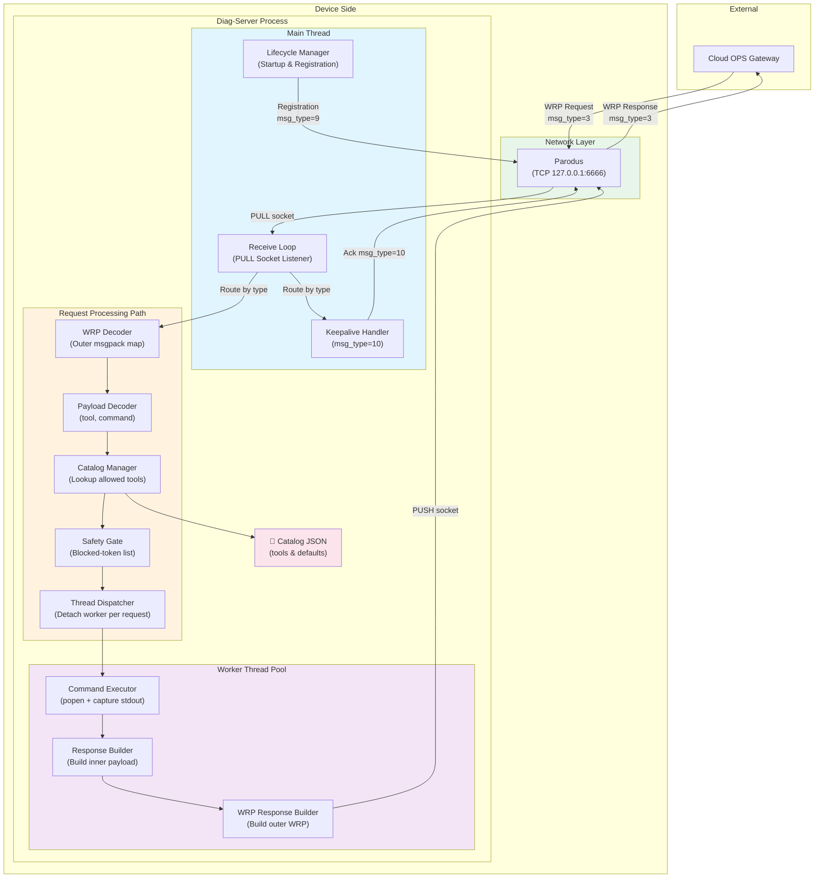
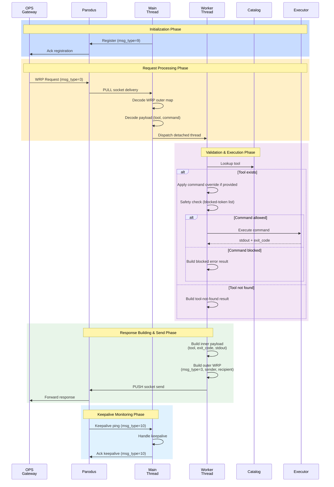

# Device Side Communication - Component Diagram

## Component Architecture (Device Side)

## Data Flow Sequence (Device Side)

## Component Responsibilities

| Component | Responsibility | Technology |
|-----------|-----------------|------------|
| **Parodus** | Messaging gateway between device & cloud | nanomsg TCP |
| **Main Thread** | Initialization, socket management, receive loop coordination | POSIX threads |
| **WRP Decoder** | Parse outer msgpack WRP message envelope | msgpack-c |
| **Payload Decoder** | Extract tool & command from request payload | msgpack-c, cJSON |
| **Catalog Manager** | Load & lookup allowed tools from JSON | cJSON |
| **Safety Gate** | Validate commands against blocked-token list | String matching |
| **Thread Dispatcher** | Create detached worker thread per request | pthread_create |
| **Command Executor** | Run shell command and capture output | popen/pclose |
| **Response Builder** | Serialize result into msgpack payload | msgpack-c |
| **Keepalive Handler** | Monitor & respond to keepalive pings | nanomsg |

## Key Design Patterns

1. **Asynchronous Request Handling**: Main thread stays responsive by delegating execution to detached worker threads
2. **Layered Validation**: Request validation happens in stages (catalog → safety gate) before execution
3. **Message Envelope Pattern**: WRP outer envelope + msgpack inner payload separation
4. **Resource Safety**: Command output capped at 64KB, command execution timeout at 10s
5. **Graceful Degradation**: Missing tools/blocked commands return error results instead of crashes

## Message Types Used

- **msg_type=3**: Request/Response (bidirectional)
- **msg_type=9**: Service Registration (device → cloud)
- **msg_type=10**: Keepalive ping/ack (bidirectional)

## Socket Configuration

| Socket | Type | URL | Purpose |
|--------|------|-----|---------|
| PUSH | nanomsg | 127.0.0.1:6666 | Send responses & register to Parodus |
| PULL | nanomsg | 127.0.0.1:6669 | Receive requests from Parodus |
