# Diag-Server

Diag-Server is a lightweight diagnostic execution service for RDK CPE devices. It integrates with Parodus over nanomsg, receives WRP requests, executes a catalog-defined diagnostic command, and returns command output in a WRP response.

This repository currently contains:
- `diag-server-nn.c`: Main service implementation.
- `diag-triage-catalog.json`: Example diagnostic tool catalog.
- `CMakeLists.txt`: Build configuration.

> **Corrections applied 2026-08-14** — see
> `docs/24_diag_server_merge_plan.md` §2 in the RDK Dispatcher project
> for the review that found these: (1) the build/source filename
> mismatch this document previously warned about did not actually
> exist in `CMakeLists.txt` — that file already built
> `diag-server-nn.c` correctly, only this documentation was stale; the
> warning below has been removed. (2) `CMakeLists.txt` linked
> `wrp-c`, `libparodus`, and `cimplog`, none of which the code calls
> into (it talks to Parodus over raw nanomsg directly) — those unused
> dependencies have been removed from the build configuration and
> from the prerequisites list below. (3) Catalog `timeout` is now
> enforced — see §1.4 and §2.2 below; the "not currently used" gap
> language has been removed. (4) Command execution no longer uses a
> shell at all (`/bin/sh -c` removed, not just `popen()`) — see §1.4
> and §3.5 below. (5) `is_command_safe()` now also pins a caller
> override's program to the catalog's declared program, unless the
> tool's catalog entry opts out via `"type": "dynamic"` — see §1.4
> item 4 and §3.5. (6) Every catalog tool now also declares `"type"`
> and `"plane"` — see §3.5. (7) Every tool's static catalog command is
> now validated once, at process startup, instead of on every request
> — see §1.4 item 6 and §2.5 (new).

## 1. Architecture Guide

### 1.1 High-Level Components

1. Service Runtime (`diag-server-nn.c`)
- Owns process lifecycle and signal handling.
- Loads diagnostic tool catalog at startup.
- Registers itself with Parodus.
- Receives and decodes WRP traffic.
- Dispatches diagnostic requests to worker threads.
- Sends responses back to Parodus.

2. Catalog (`diag-triage-catalog.json`)
- Defines allowed tools and default shell commands.
- Example structure:
  - `tools.<tool-name>.command`
  - `tools.<tool-name>.timeout` — enforced (corrected 2026-08-14): used
    as the per-tool wall-clock ceiling; falls back to a 30s default
    when absent.

3. Transport Layer (nanomsg + WRP over msgpack)
- PUSH socket to Parodus at `tcp://127.0.0.1:6666`.
- PULL socket bound locally at `tcp://127.0.0.1:6669`.
- WRP registration type: 9.
- WRP request/response type: 3.
- WRP keepalive type: 10.

### 1.2 Data and Control Flow

```mermaid
flowchart LR
    A[OPS Gateway] --> B[Parodus]
    B -->|WRP REQ type=3| C[Diag-Server PULL 127.0.0.1:6669]
    C --> D[Decode outer WRP msgpack]
    D --> E[Decode inner payload msgpack]
    E --> F[Tool lookup in catalog]
    F --> G[Safety gate blocked command check]
    G --> H[Execute via fork/exec, timeout-enforced]
    H --> I[Build inner response payload]
    I --> J[Build outer WRP response type=3]
    J --> K[Diag-Server PUSH 127.0.0.1:6666]
    K --> B
    B --> A
```



### 1.3 Threading Model

- Main thread:
  - Initializes sockets and registration.
  - Runs receive loop on PULL socket.
  - Handles keepalive (type 10) inline.
- Worker threads:
  - Each WRP request (type 3) is processed in a detached pthread.
  - This prevents long command execution from blocking socket receive.

### 1.4 Security and Safety Controls

1. Allowlist by catalog
- Requested `tool` must exist in catalog.

2. Blocklist by first token
- The executable token of the command is checked against blocked commands:
  - `rm`, `rmdir`, `reboot`, `shutdown`, `halt`, `poweroff`, `factory_reset`,
  - `kill`, `killall`, `pkill`, `dd`, `mkfs`, `fdisk`, `mount`, `umount`, `iptables`, `passwd`.

3. Output size cap
- Command stdout capture is limited to 64 KiB.

4. Program pinning for command overrides (added 2026-08-14; **superseded
   for static tools 2026-08-16, see item 5 below**)
- `is_command_safe()` is the single, common check that both a
  catalog-default command and a caller-supplied `command` override go
  through before execution — it's not two separate checks in two
  places, one call site enforces both.
- On top of the blocklist (item 2), it requires that a caller-supplied
  override's program (its first argument token) be identical to the
  program the catalog itself declares for that tool. An override can
  still change arguments (e.g. request a different ping target), but
  can't redirect a tool to run an entirely different, non-blocklisted
  program.
- **As of 2026-08-16, this whole check only ever runs for `"dynamic"`
  tools** — see item 5. It's kept, not deleted, but its single call site
  in `handle_request()` no longer reaches it for static tools at all.
- Historical residual (closed 2026-08-16 for static tools, see item 5):
  this pinned the *program*, not the *arguments* — an override naming
  the same program with different arguments (e.g. pointing
  `device_uptime`'s `cat` at a different file) used to still execute.
  See `REQUIREMENTS.md` §12 Risk item 5.

5. Static vs. dynamic tools (added 2026-08-14; static-override behavior
   changed 2026-08-16)
- A catalog tool entry declares `"type": "static"` (the default; every
  pre-existing tool) or `"type": "dynamic"` (see the `adhoc_diagnostic`
  example in `diag-triage-catalog.json`).
- **As of 2026-08-16 (§9 Q3, docs/24 §14 item 7): a static tool no
  longer honors a caller-supplied `command` override at all.** Whatever
  the catalog declares as that tool's `command` always runs, whether or
  not the request includes an override, and regardless of the
  override's content — item 4's program-pin check isn't even reached
  for a static tool anymore, since there's nothing left to validate.
  This fully closes the "same program, different arguments" gap noted
  in item 4, rather than narrowing it. A request with an override for a
  static tool now logs an informational note (`LOG_INFO`) that the
  override was ignored, and proceeds using the catalog command.
- For a **dynamic** tool, nothing changed: the caller is expected to
  supply the command outright, item 4's program-pin is skipped by
  design (no fixed program to pin against), and the blocklist (item 2)
  still applies unconditionally.
- `"plane"` is a separate, informational field (`config-apply`,
  `management`, `control`, or `triage`) categorizing the tool for the
  wider RDK Dispatcher project's toolset-manifest conversion — see
  `docs/24_diag_server_merge_plan.md` §8 step 2. diag-server logs it
  but does not act on it.

6. Init-time static command validation and the "skipped" category
   (added 2026-08-14)
- Every tool's own catalog `command` (not a caller override — see
  below) is validated exactly once, right after the catalog loads at
  process startup, before either transport socket exists and before
  any request can possibly arrive. See §2.5.
- A tool whose static command fails this check (blocklisted, or
  unparseable — e.g. empty/whitespace-only) is marked **skipped**: it
  is rejected for the rest of the process's lifetime, for *any*
  request naming it — including one that supplies its own,
  independently-safe override command. A skipped tool doesn't get a
  second chance through a clever override; the whole entry is taken
  out of service. This is deliberately a blanket exclusion, not a
  narrower "only the default-command path is blocked" rule.
- For a tool that passes validation, its program name is cached once
  (as `argv[0]` of its `command`) and reused for every subsequent
  program-pin comparison (item 4) — no request re-tokenizes or
  re-blocklist-checks the catalog's own command string, since it
  cannot have changed since startup (there is no catalog hot-reload
  anywhere in this code). Only a caller-supplied override — whose
  content genuinely cannot be known ahead of time — still runs a live
  check per request.
- Every skip is logged individually at startup (`LOG_WARNING`) with
  the tool name, its command, and the reason, plus a one-line summary
  (`static command validation: N checked, M skipped`) — so a
  misconfigured catalog is visible in syslog at service start, not
  discovered later only when something happens to invoke the broken
  tool.

7. Current gaps to know
- ~~Catalog `timeout` field is not currently used to terminate
  commands.~~ Fixed 2026-08-14 — enforced with a 30s default fallback;
  see §2.2.
- ~~Command execution uses `popen`/a shell, so shell expansion and
  redirection are possible.~~ Fixed 2026-08-14 — execution is now
  `execvp()` with a tokenized argument vector (`tokenize_argv()`); no
  shell is invoked anywhere in the path. `command` strings (catalog or
  caller-supplied) are split into literal argv tokens, not interpreted
  — see §3.5/§3.6 and NFR-17 in `REQUIREMENTS.md`.
- ~~A caller-supplied `command` field overrides the catalog entry and is
  only checked by first token~~ — see `docs/24_diag_server_merge_plan.md`
  §2 in the RDK Dispatcher project for why this was a real
  command-injection path, not just a style concern. **Narrowed in two
  stages, both 2026-08-14**: (1) since there's no shell anymore, a
  compound override like `cat /proc/uptime; rm -rf /tmp/x` no longer
  runs `rm` — the whole string becomes literal arguments to `cat`,
  which just fails; (2) `is_command_safe()` (item 4 above) additionally
  rejects an override naming a *different program* than the catalog
  declares for that tool — for **static** tools. A **dynamic** tool
  (item 5 above) intentionally has no program to pin, so this
  narrowing doesn't apply to it; that's the tradeoff of declaring a
  tool dynamic, not a bug. **Closed 2026-08-16, for static tools**: an
  override naming the *same* program with different arguments than
  intended (e.g. redirecting `device_uptime`'s `cat /proc/uptime` to
  `cat /etc/shadow`) no longer executes at all — static tools stop
  honoring overrides entirely (item 5 above), rather than restricting
  them to a catalog-declared parameter set. Dynamic tools are
  unaffected.
- ~~There is no access-control check of any kind on who may invoke a
  tool.~~ Narrowed 2026-08-15 — `diag_acl_check()` gates every request
  in `handle_request()`; see §4.1's ACL gate bullet above and
  `docs/24_diag_server_merge_plan.md` §13.4. Still Phase-2-gated:
  `acl_policy_store_query()`'s transport isn't implemented yet, so the
  check compiles and is wired in but can't link into a runnable binary
  until that's chosen.

## 2. Workflow Guide

### 2.1 Startup Workflow

1. Process starts and installs signal handlers (`SIGTERM`, `SIGINT`).
2. **Changed 2026-08-15 (docs/24_diag_server_merge_plan.md §15 B.5)**:
   catalogs are loaded per plane, not from one file:
- Default directory: `/etc/diag-server`
- Override: first CLI argument (now a *directory*, not a file path).
- Each of `diag-triage-catalog.json`, `diag-management-catalog.json`,
  `diag-control-catalog.json`, `diag-config-apply-catalog.json` is
  loaded from that directory if present; a plane with no file there is
  simply not served (not an error).
3. **Added 2026-08-14**: every tool's static catalog `command` is
   validated once (blocklist + parseability), *before* any socket is
   opened — see §2.5. Tools that fail are marked skipped for the rest
   of the process's life; tools that pass get their program name
   cached for fast override checks later.
4. Service binds PULL socket at `tcp://127.0.0.1:6669`.
5. Service connects PUSH socket to Parodus at `tcp://127.0.0.1:6666` with retry/backoff.
6. Sends WRP registration message with:
- `msg_type = 9`
- `service_name = diag-server`
- `url = tcp://127.0.0.1:6669`

### 2.2 Request Processing Workflow

1. Receive outer WRP map.
2. Accept only request messages (`msg_type = 3`) for tool execution.
3. Decode inner payload map:
- `tool` (required)
- `command` (optional)
4. **Added 2026-08-14**: if the tool was marked skipped at startup
   (§2.5), reject immediately here — regardless of whether this
   request supplies its own `command` — and skip steps 5–6 below.
5. Resolve command:
- If payload command is empty, fallback to catalog command (already
  proven safe at startup — no re-check needed).
- If payload command is present (an override), apply the blocklist and
  program-pin check (§1.4 item 4) live, using the cached program name
  from step 3 of §2.1.
6. Execute allowed command.
7. Build inner payload response:
- `tool`
- `exit_code`
- `stdout` (binary field)
8. Wrap into outer WRP response and send to requester.

### 2.3 Keepalive Workflow

- If incoming WRP has `msg_type = 10`, service immediately returns type 10 ack.

### 2.4 Shutdown Workflow

1. Signal sets runtime flag to stop loop.
2. Sockets are closed.
3. Catalog memory is released.
4. Syslog is closed.

### 2.5 Init-Time Static Command Validation (added 2026-08-14)

Design goal (as requested): call the safety check for each tool's
*static* catalog command during process initialization itself, so
runtime request handling never repeats work whose answer cannot have
changed since startup.

**Why this is safe to do once**: the catalog loads exactly once, in
`load_catalog()`, and nothing in this codebase ever reloads it while
the process runs — there's no hot-reload path, no `SIGHUP` handler for
it, nothing. A tool's own declared `command` string is therefore a
fixed value for the entire life of the process. Checking it against
the blocklist (or confirming it tokenizes to at least one argument) on
every single request that happens to use the catalog default was pure
repeated work with a guaranteed-identical answer every time.

**Sequence, exactly as it runs in `main()`**:

```
load_catalogs()                   -- parses each plane's catalog file into g_planes[] (§15 B.5)
validate_static_commands()        -- NEW: walks every tool, once, per plane
  for each tool with a non-empty "command":
    tokenize it
      -> fails (empty/unparseable)?      mark "_skipped", reason recorded
      -> is_blocked() on the full string? mark "_skipped", reason recorded
      -> otherwise: cache argv[0] as "_program_token" on the entry
  log each skip individually (LOG_WARNING) + a one-line summary
-- only now are the PULL/PUSH sockets created --
nn_socket(...) / nn_bind(...) / nn_connect(...)
-- only now can a request possibly arrive --
```

A tool with no `command` field at all (a `"type": "dynamic"` tool with
no fallback default, like `adhoc_diagnostic`) has nothing to validate
here and is left untouched — neither skipped nor given a
`_program_token`, exactly as it behaved before this change.

**What "marked as skipped" means for `handle_request()`**: a skipped
tool is rejected for *every* request naming it, for the rest of the
process's life — including a request that supplies its own,
independently-safe `command` override. This is a deliberate,
whole-tool exclusion: a catalog entry whose own declared command is
dangerous or malformed signals a misconfigured catalog, and the safer
default is to take the entry out of service entirely rather than leave
a path where a well-chosen override could still reach it. (Verified:
see the standalone-harness test that injects a deliberately
blocklisted tool, confirms it gets marked skipped with the right
reason, and confirms an independently-safe override sent against it is
*still* rejected — not just the tool's own broken default.)

**What still runs at request time, and why it has to**: only a
caller-supplied override's live content — which cannot be known ahead
of time — still goes through `is_command_safe()` per request. That
check itself got cheaper too: it now takes the tool's cached
`_program_token` instead of the raw catalog command string, so it no
longer re-tokenizes the (unchanging) catalog side on every call — only
the override's own string gets tokenized, since that's the only piece
that's actually new each time.

### 3.1 Prerequisites

Runtime/build dependencies inferred from code and CMake:
- Compiler with C11 support.
- CMake >= 3.10.
- pthread.
- nanomsg.
- msgpack-c.
- cJSON.

### 3.2 Build

```bash
cmake -S . -B build
cmake --build build
```

### 3.3 Install

```bash
cmake --install build
```

By default, target installs to:
- `${CMAKE_INSTALL_PREFIX}/bin/diag-server`

### 3.4 Prepare Catalog

**Changed 2026-08-15 (§15 B.5)**: one catalog file per plane, not a
single `catalog.json`.

1. Place per-plane catalog file(s) at the default directory:
- `/etc/diag-server/diag-triage-catalog.json`,
  `/etc/diag-server/diag-management-catalog.json`,
  `/etc/diag-server/diag-control-catalog.json`,
  `/etc/diag-server/diag-config-apply-catalog.json` — only the planes
  actually populated are served; the rest are simply absent.
2. Or pass a custom catalog *directory* as argument.

Example start command:

```bash
./diag-server /path/to/catalog/dir
```

### 3.5 Catalog Format

Minimum format:

```json
{
  "tools": {
    "device_uptime": {
      "command": "cat /proc/uptime",
      "timeout": 5,
      "type": "static",
      "plane": "triage"
    },
    "active_connections": {
      "command": "/bin/netstat -n",
      "suppress_stderr": true,
      "count_lines_matching": "ESTABLISHED",
      "timeout": 5,
      "type": "static",
      "plane": "triage"
    },
    "adhoc_diagnostic": {
      "timeout": 15,
      "type": "dynamic",
      "plane": "triage"
    }
  }
}
```

Notes:
- `command` is the executable string. **Corrected 2026-08-14 (NFR-17):**
  this is now tokenized directly into an argument vector for `execvp()`
  — there is no shell in the execution path. It must be a program path
  or name plus its arguments, split on whitespace (a double-quoted
  segment counts as one token, e.g. `foo "arg with spaces"`). Shell
  syntax — pipes (`|`), redirects (`>`, `2>`), command separators
  (`;`, `&&`), backticks, `$()`, globs — has no effect; it's passed
  through as literal argument text, not interpreted. Optional for a
  `"type": "dynamic"` tool (see below) — if omitted, the caller must
  supply a `command` in the request or nothing runs.
- `timeout` is enforced: per-tool wall-clock ceiling in seconds. If
  absent or non-positive, a 30s default applies.
- `suppress_stderr` (boolean, optional, added 2026-08-14): redirects
  the command's stderr to `/dev/null` — replaces a shell command
  string's former inline `2>/dev/null`.
- `count_lines_matching` (string, optional, added 2026-08-14): if set,
  the response's stdout becomes the decimal count of the command's own
  output lines containing this substring, followed by a newline —
  replaces a shell command string's former inline
  `| grep <substring> | wc -l`.
- `type` (string, optional, added 2026-08-14): `"static"` (the
  default) or `"dynamic"`. A static tool's program is pinned to its
  own `command` (§1.4 item 4) even if a caller override changes
  arguments. A dynamic tool has no program pin — the caller is
  expected to supply the command — but the blocklist (§1.4 item 2)
  still applies to it unconditionally.
- `plane` (string, optional, added 2026-08-14): one of `config-apply`,
  `management`, `control`, `triage` — categorization metadata for the
  wider RDK Dispatcher project, not consumed by diag-server's own
  logic (see §1.4 item 5).

### 3.6 Request and Response Payloads

Inner payload request (msgpack map):

```json
{
  "tool": "device_uptime",
  "command": "",
  "plane": ""
}
```

- If `command` is omitted/empty, catalog command is used.
- `plane` (string, optional, **added 2026-08-15, §15 B.5** — not to be
  confused with the catalog entry's own `plane` metadata field, §3.5
  above): if supplied, the tool is looked up *only* in that plane's
  catalog — a miss there is a miss, it does not fall through to search
  other planes. If omitted (every request before this change, and any
  caller not yet updated to send it), diag-server searches every loaded
  plane's catalog for the name; if that name exists in more than one
  plane, the request is rejected as ambiguous rather than guessed at —
  a plane-qualified request for either one still resolves normally.

Inner payload response (msgpack map):

```json
{
  "tool": "device_uptime",
  "exit_code": 0,
  "stdout": "<binary stdout bytes>"
}
```

The above (EXEC) is the only shape this service spoke until 2026-08-15.
**Added 2026-08-15 (docs/24_diag_server_merge_plan.md §11.1/§15 B.3)**:
four more message kinds ride this same inner-payload/outer-WRP-envelope
convention, disambiguated by an optional `"kind"` string field EXEC
itself never sends:

- **DESCRIBE** — `{"kind":"DESCRIBE", "plane": ""}` (`plane` optional)
  → one plane's `{plane, version, tools:[{name,type,plane,timeout}]}`,
  or (no `plane` given) an array of that shape per currently-loaded
  plane.
- **HEALTH** — `{"kind":"HEALTH"}` → `{"status":"ok"}`. Side-effect-free;
  doesn't touch the catalog.
- **PUSH** — `{"kind":"PUSH", "plane", "base_version", "target_version", "diff": {"added":{},"removed":[],"modified":{}}}`
  → `{"status":"loaded","plane","version"}` or
  `{"status":"rejected","plane","reason"}`. `base_version` must match
  the target plane's *current* live version exactly (compare-and-swap,
  not "newer than") or the push is rejected before anything else is
  attempted. On success, the promoted catalog is also persisted to disk
  (§15 B.2.5) before the response is sent.
- **CHANGED** — unsolicited, sent by diag-server itself right after a
  successful PUSH promote: `{"kind":"CHANGED","plane","version"}`.

These are local-protocol additions, not part of the frozen external
wire contract (§3) — they exist for the same connection EXEC already
answers on, and none of EXEC's own two original fields or byte shape
changed.

### 3.7 Observability

- Logging uses syslog with ident `diag-server`.
- Typical logs include:
  - startup and registration
  - received request UUID/source
  - executed command
  - exit code and response send status
  - connection retry errors

### 3.8 Troubleshooting

1. No responses from service
- Verify Parodus is listening on `127.0.0.1:6666`.
- Verify service bound `127.0.0.1:6669`.
- Check registration log event in syslog.

2. Tool not found
- Ensure requested `tool` key exists under catalog `tools`.

3. Command blocked or missing
- Requested/fallback command may be blocklisted.
- Verify command starts with an allowed executable token.
- **Added 2026-08-14**: a `command` override is also rejected if its
  program doesn't match the catalog entry's own declared program for
  that `tool` — check syslog for `unsafe command rejected for tool
  '<tool>'` to distinguish this from a plain blocklist hit (see §1.4
  item 4).

4. Output truncated
- Stdout is capped at 64 KiB by design.

5. Response has `exit_code: 124` and output `"command timed out after
   Ns"` (added 2026-08-14)
- The command exceeded its timeout (catalog `timeout` field, or the
  30s default if the catalog doesn't declare one) and was killed.
- Not an error in diag-server itself — check whether the underlying
  command is expected to take that long, and raise the catalog
  `timeout` value for that tool if so.

6. A catalog `command` that used to work now fails, or a new tool with
   a pipe/redirect in its command never produces the expected output
   (added 2026-08-14)
- Command execution no longer goes through a shell (NFR-17, §3.5) —
  `command` is tokenized into literal arguments, so `|`, `>`, `2>`,
  `;`, `&&`, backticks, and `$()` are not interpreted; they're passed
  as plain text to whatever program is `argv[0]`, which will usually
  just fail on the unexpected argument.
- If the tool needs a stderr redirect, use `suppress_stderr: true`
  instead of `2>/dev/null` in the command string.
- If the tool needs to count matching output lines (the
  `| grep X | wc -l` pattern), use `count_lines_matching: "X"` instead.
- Anything else that genuinely needs shell features (globbing,
  variable expansion, multi-stage pipelines beyond a single count
  filter) currently has no catalog-level equivalent — file it as a gap
  rather than trying to smuggle shell syntax back into `command`.

7. Response has `exit_code: 1` and output starting with `"tool skipped
   at init:"`, and this happens for *every* request against that tool,
   even ones with their own `command` (added 2026-08-14)
- The tool's own catalog `command` failed init-time validation (§2.5)
  — it's either blocklisted or unparseable. Check syslog at service
  startup for `catalog validation: tool '<tool>' marked skipped at
  init (<reason>): command='<command>'`.
- This is not a per-request issue and cannot be worked around by
  sending a different `command` in the request — the whole tool is
  excluded until the catalog is fixed and the service is restarted
  (there's no hot-reload; a catalog fix only takes effect on the next
  process start).
- Fix the catalog entry's `command` field and restart the service.

## 4. Developer Notes

### 4.1 Key Constants

- Parodus URL: `tcp://127.0.0.1:6666`
- Client bind URL: `tcp://127.0.0.1:6669`
- Local endpoint (added 2026-08-15, §15 B.4 part 1 — additive, alongside
  the public pair above, best-effort at startup): recv
  `ipc:///run/dispatcher/diagnostics-in.sock`, send
  `ipc:///run/dispatcher/diagnostics-out.sock`. PUSH is only accepted
  here — a PUSH received via the public pair is rejected outright (no
  ACL check gates it otherwise, see below). DESCRIBE/HEALTH/EXEC are
  reachable on both.
- Registration to Parodus (§15 B.4 part 2 — **flipped 2026-08-16**,
  after D.1/D.3 both passed): `REGISTER_WITH_PARODUS` is `0` —
  diag-server no longer sends its WRP type-9 registration, so Parodus
  has no route to `CLIENT_URL` and the local endpoint is now the only
  practically reachable address. The public PULL/PUSH sockets
  themselves are still bound/connected (outbound traffic like
  `capability_sync.updated` is unaffected); only the registration send
  is gated. Revert by flipping `REGISTER_WITH_PARODUS` back to `1`.
- ACL gate (added 2026-08-15, §13.4): every EXEC request now passes
  through `diag_acl_check()` before catalog lookup — denial returns
  `exit_code=126`/`stdout="access denied"`. Thin wrapper around
  `acl_policy_store_query()`, the same entry point every other toolset
  already uses; that function has no implementation anywhere in this
  codebase yet (transport still unresolved, Phase 2), so this code
  compiles clean but won't link into a runnable binary until that's
  chosen elsewhere.
- Capability-sync (added 2026-08-15, §13.4): a successful PUSH promote
  now also sends a `capability_sync.updated` JSON-RPC notification over
  the public Parodus connection, alongside the existing local-only
  CHANGED notification.
- Default catalog directory: `/etc/diag-server` (one file per plane — §15 B.5)
- Receive timeout: 2000 ms
- Send timeout: 5000 ms
- Max captured stdout: 65536 bytes
- Default per-tool execution timeout: 30s (corrected 2026-08-14;
  catalog-overridable via `tools.<name>.timeout`)
- Static command validation: runs once, at startup, before any socket
  exists (added 2026-08-14; see §2.5)

### 4.2 Known Improvement Areas

1. ~~Enforce per-tool execution timeout from catalog.~~ Done
   2026-08-14 — see §1.4/§2.2/§3.5.
2. ~~Move from shell-based execution (`/bin/sh -c`) to safer
   `execve`-style invocation without shell interpretation.~~ Done
   2026-08-14 — `run_command()` now calls `execvp()` with an argument
   vector built by `tokenize_argv()`; no shell is invoked anywhere.
   `active_connections`, the one catalog entry that relied on a shell
   pipe, was rewritten using the new `suppress_stderr`/
   `count_lines_matching` catalog fields (§3.5) instead.
3. ~~Add stricter argument-level validation for command overrides.~~
   **Done, but via the other named alternative, not argument-level
   validation itself.** 2026-08-14: `is_command_safe()` (§1.4 item 4)
   first pinned an override's *program* to the catalog's declared
   program, closing the "run an entirely different program" half of
   the gap. **2026-08-16 (§9 Q3, §1.4 item 5)**: rather than adding a
   per-tool allowed-argument schema, static tools stop honoring
   overrides at all — the catalog's own command always runs. This
   closes the remaining "same program, different arguments" gap
   completely for static tools, via the "drop overrides entirely"
   alternative rather than the "argument-level allowlist" alternative;
   dynamic tools are unaffected, since caller-supplied commands are
   their whole purpose.
4. ~~Add an access-control check before executing any tool.~~ Done
   2026-08-15 — see §1.4 item 7 above and §13.4 in
   `docs/24_diag_server_merge_plan.md`. Still Phase-2-gated on the ACL
   Policy Store's transport.
5. Add unit tests for msgpack encoding/decoding.
6. Add integration test harness with mock Parodus endpoint.

## 5. File Map

- `diag-server-nn.c`: main daemon logic (transport, decoding, execution, response).
- `diag-triage-catalog.json`: sample diagnostics catalog.
- `CMakeLists.txt`: build, link, and install configuration.
